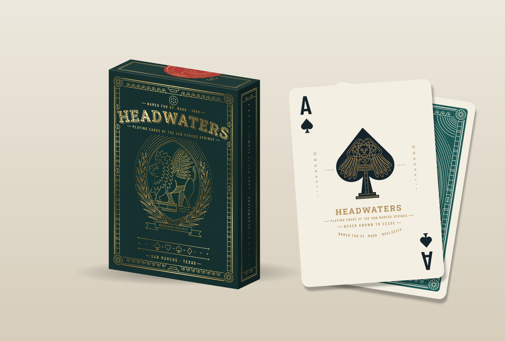
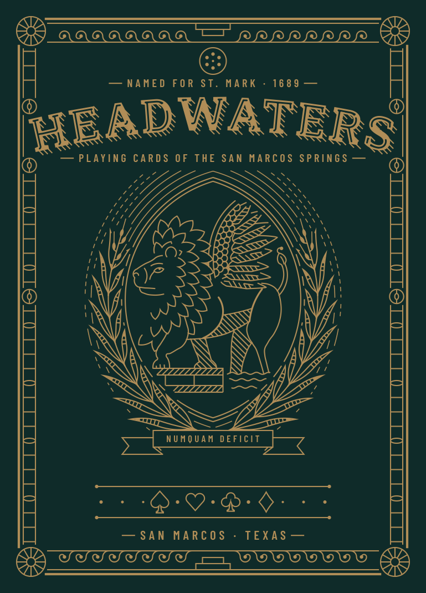
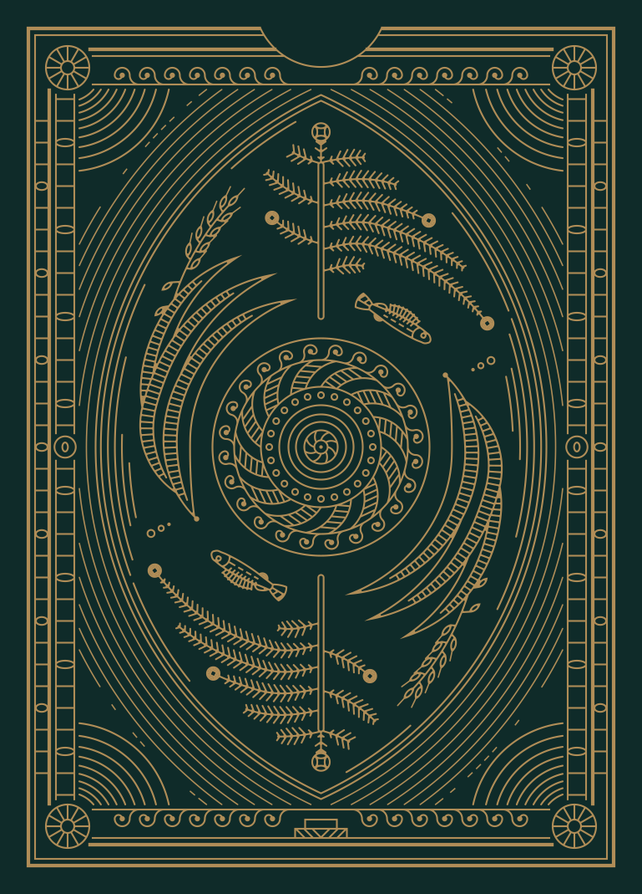
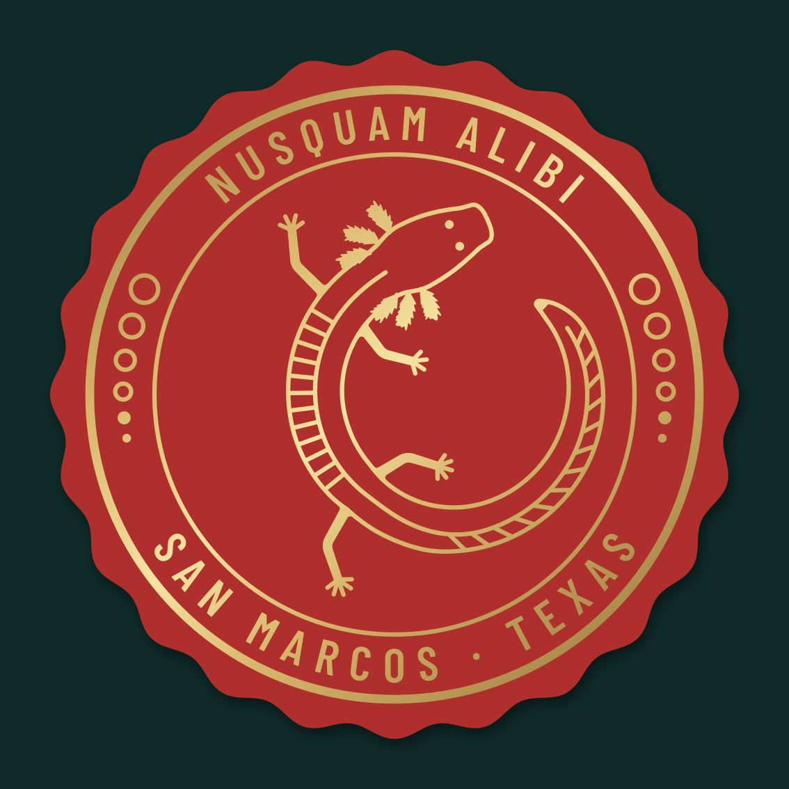

# HEADWATERS — playing cards of the San Marcos springs

A 54-card poker deck, card back, tuck box and seal inspired by San Marcos, Texas, drawn as
premium monoline vector line art in the spirit of Curtis Jinkins' Monarchs and Drifters.
All artwork is original and generated from code.

*Long may it flow.*



## Deck


## Deck box and seal







| House | Suit | Theme |
|---|---|---|
| the Deep | ♠ | the Edwards Aquifer, limestone, the Balcones fault, the blind salamander |
| the Fount | ♥ | Spring Lake: the vents, glass-bottom boats, Aquamaid heritage, song |
| the Reed | ♣ | the riverbanks: Texas wild-rice, bald cypress, kingfisher, pecan |
| the Ford | ♦ | El Camino Real's river crossing and the town: courthouse dome, Justice |

## Where things are

| Path | What |
|---|---|
| `cards/*.svg` | the 55 finished card faces + back (750 × 1050 = 2.5 × 3.5 in at 300 ppi) |
| `tuck/*.svg` | tuck front, back, flat on dieline, seal |
| `print/` | print exports: `bleed/` (825 × 1125), `plates/` (one black separation per ink), `HEADWATERS-bleed.pdf`, `HEADWATERS-trim.pdf` |
| `build/png/`, `build/contact.png`, `build/tuck/` | previews and mock-ups |
| `research/creative-brief.md` | the authoritative brief (every dimension, colour, weight and piece) |
| `research/style.md`, `research/san-marcos.md` | Jinkins style study and the San Marcos motif bible (with sources) |
| `deck/` | the design system: tokens, pips, index, frames, build, QA, court kit, ornament motifs |
| `art/<ID>.py` | one module per illustrated piece (courts, aces, jokers, back) |
| `inkkit/` | the underlying SVG line-art toolkit |
| `tools/` | `preview.py` (draft any module), `export_print.py`, `make_gallery.py` |

## Commands (from this folder)

```sh
.venv/bin/python -m deck.build all                 # cards/*.svg + build/png + build/contact.png
.venv/bin/python -m deck.build all --stock white   # white-stock variant (QA)
.venv/bin/python -m deck.qa all                    # machine checks from the brief's §I checklist
.venv/bin/python tuck/build_tuck.py                # tuck box
.venv/bin/python tuck/build_seal.py                # seal
.venv/bin/python tools/export_print.py             # print/ (bleed, plates, PDFs)
.venv/bin/python tools/make_gallery.py             # build/gallery/index.html
```

The venv needs `fonttools numpy shapely skia-pathops svgelements pillow scipy`; rendering uses
`rsvg-convert` (and `resvg` for QA). Fonts are OFL (Barlow Condensed, Roboto Slab) in `fonts/`.

## Before print

- Clear the HEADWATERS trademark (see brief §A).
- Replace the placeholder tuck dieline with the printer's dieline.
- The tuck's Indigenous acknowledgment line is on hold pending review (brief §H.20).
- Match the spot inks: Aquifer `#15242B`, Gill Red `#AE2F2B`, Spring Jade `#1D5A55`, and a
  metallic gold (PMS 871-type) for Lion Gold `#B08D57`.
