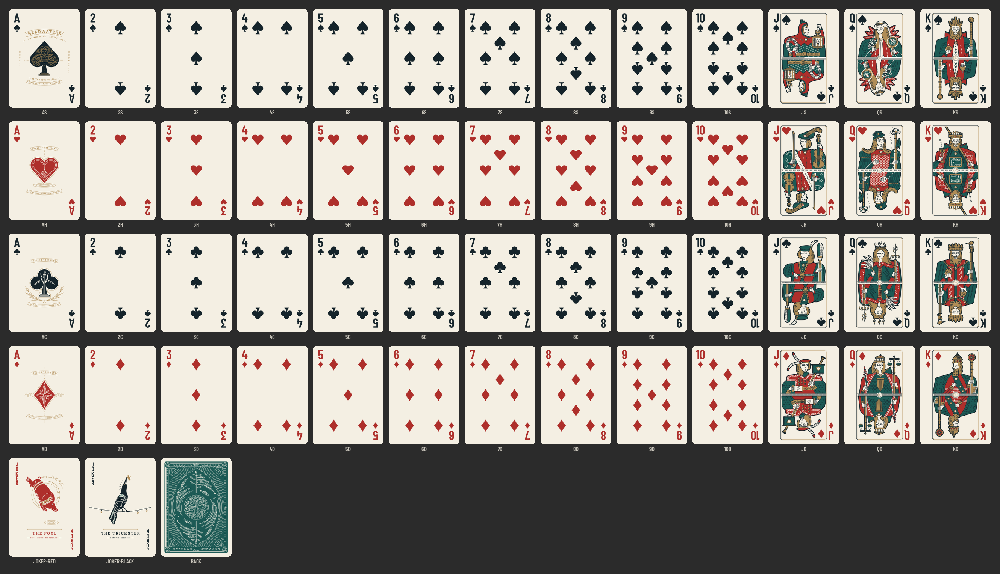

# San Marcos cards test

HEADWATERS playing cards of the San Marcos springs.

## Deck

`cards/` holds 55 SVGs: the 52 ranks, `JOKER-RED`, `JOKER-BLACK`, and `BACK`. Each file is 750×1050.

## Deck box and seal

`tuck/` holds the tuck box panels (`TUCK-FRONT`, `TUCK-BACK`, `TUCK-SIDE-A`, `TUCK-SIDE-B`, `TUCK-TOP`, `TUCK-BOTTOM`, `TUCK-FLAT`) and `SEAL.svg`.

## Reference images

`research/refs/` holds the reference images used while designing the deck.
